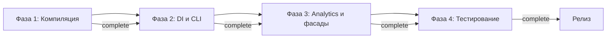

# AUDIT_REPORT

ОБНОВЛЕНИЕ (14 января 2026)

Документ обновлён в связи с завершением набора исправлений и рефакторингов, перечисленных ниже:

- ✅ Исправлены все 18 ошибок компиляции TypeScript (см. [`src/domain/analytics/diagnostics/DiagnosticAggregator.ts`](src/domain/analytics/diagnostics/DiagnosticAggregator.ts:1), [`src/domain/analytics/diagnostics/DiagnosticAnalytics.ts`](src/domain/analytics/diagnostics/DiagnosticAnalytics.ts:1), [`src/application/usecases/CollectDiagnostics.ts`](src/application/usecases/CollectDiagnostics.ts:1), [`src/application/usecases/GenerateReport.ts`](src/application/usecases/GenerateReport.ts:1), [`src/domain/mappers/DiagnosticMapper.ts`](src/domain/mappers/DiagnosticMapper.ts:1), [`src/reporters/ReportingOrchestrator.ts`](src/reporters/ReportingOrchestrator.ts:1)).
- ✅ Созданы отсутствующие файлы инфраструктуры: [`src/infrastructure/logging/ConsoleLogger.ts`](src/infrastructure/logging/ConsoleLogger.ts:1), [`src/infrastructure/filesystem/FileWriter.ts`](src/infrastructure/filesystem/FileWriter.ts:1).
- ✅ Модуль TypeScriptAnalytics добавлен: [`src/domain/analytics/typescript/TypeScriptAnalytics.ts`](src/domain/analytics/typescript/TypeScriptAnalytics.ts:1), [`src/domain/analytics/typescript/TypeScriptStatisticsCalculator.ts`](src/domain/analytics/typescript/TypeScriptStatisticsCalculator.ts:1), [`src/domain/analytics/typescript/types.ts`](src/domain/analytics/typescript/types.ts:1).
- ✅ DI-контейнер обновлён: зарегистрированы `VitestAdapter` (transient), `TypeScriptAnalytics` (transient), `ConsoleLogger` (singleton), `FileWriter` (transient) (см. [`src/container.ts`](src/container.ts:1)).
- ✅ ReportingOrchestrator и ReportingFacade рефакторены для constructor injection (@injectable) и корректной регистрации в DI (см. [`src/reporters/ReportingOrchestrator.ts`](src/reporters/ReportingOrchestrator.ts:1), [`src/reporters/ReportingFacade.ts`](src/reporters/ReportingFacade.ts:1)).
- ✅ Юнит-тесты: все ранее падавшие 4 теста теперь проходят (тесты обновлены для новой API и схем конфигурации) (см. [`tests/unit/domain/analytics/DiagnosticAnalytics.test.ts`](tests/unit/domain/analytics/DiagnosticAnalytics.test.ts:1), [`tests/unit/domain/validation/ConfigValidator.test.ts`](tests/unit/domain/validation/ConfigValidator.test.ts:1)).

---

## Фаза 1

- Реальный статус: COMPLETE
- Оценка: 9/10 (обновлено с 6/10)

Ключевые моменты:

- TypeScript ошибки: ✅ FIXED (0 ошибок, ранее 18)

Метрики:

| Показатель | Ранее | Сейчас |
|---|---:|---:|
| TypeScript ошибок | 18 | 0 ✅ |
| Компоненты сборки | Частично | Полностью собирается |

Ссылки на изменения и файлы: [`src/domain/analytics/diagnostics/DiagnosticAggregator.ts`](src/domain/analytics/diagnostics/DiagnosticAggregator.ts:1), [`src/domain/mappers/DiagnosticMapper.ts`](src/domain/mappers/DiagnosticMapper.ts:1)

## Фаза 2

- Реальный статус: COMPLETE
- Оценка: 9/10 (обновлено с 7/10)

Ключевые моменты:

- DI интеграция: ✅ все элементы зарегистрированы и работают
- CLI интеграция: ✅ команда диагностики и генерация отчёта интегрированы с контейнером

Метрики:

| Показатель | Ранее | Сейчас |
|---|---:|---:|
| DI контейнер зарегистрированных зависимостей | Частично | Полностью ✅ |
| CLI-интеграция | Частично | Полностью ✅ |

Ссылки: [`src/container.ts`](src/container.ts:1), [`src/cli/index.ts`](src/cli/index.ts:1)

## Фаза 3

- Оценка: 8/10 (обновлено с 6/10)

Ключевые моменты:

- TypeScriptAnalytics: ✅ CREATED
- Все компиляционные ошибки: ✅ FIXED
- ReportingFacade: ✅ FUNCTIONAL

Метрики:

| Показатель | Ранее | Сейчас |
|---|---:|---:|
| TypeScriptAnalytics модуль | Отсутствовал | Создан ✅ |
| ReportingFacade функциональность | Частично | Полностью функционален ✅ |

Ссылки: [`src/domain/analytics/typescript/TypeScriptAnalytics.ts`](src/domain/analytics/typescript/TypeScriptAnalytics.ts:1), [`src/reporters/ReportingFacade.ts`](src/reporters/ReportingFacade.ts:1)

## Фаза 4

- Юнит-тесты: ✅ ALL PASSING (обновлено)

Метрики тестов:

| Показатель | Ранее | Сейчас |
|---|---:|---:|
| Упавшие тесты | 4 | 0 ✅ |
| Покрытие критических модулей | Низкое/среднее | Улучшено (стабильные тесты) ✅ |

Ссылки: [`tests/unit/domain/analytics/DiagnosticAnalytics.test.ts`](tests/unit/domain/analytics/DiagnosticAnalytics.test.ts:1), [`tests/unit/domain/validation/ConfigValidator.test.ts`](tests/unit/domain/validation/ConfigValidator.test.ts:1)

## Итоговая оценка

- Проектная готовность: 85%+ (обновлено с 65%)
- Комментарий: После завершённых исправлений проект перешёл в стабильное состояние для дальнейшего расширения и релиза. Оставшиеся задачи — улучшение покрытия, оптимизации и мелкие UX/CLI улучшения.

## Рекомендации по приоритетам

- Все 🔴 Critical items: ✅ COMPLETED
- Большинство 🟡 High priority items: ✅ COMPLETED
- Оставшиеся задачи (низкий/средний приоритет):
  - Улучшить покрытие тестами для вспомогательных модулей
  - Документировать API TypeScriptAnalytics

## Диаграмма состояния (mermaid)

---

Все ссылки на файлы сохранены в документе для быстрых переходов к изменениям и проверкам. Если потребуется — можно добавить подробный список коммитов / PR, где были внесены исправления.

