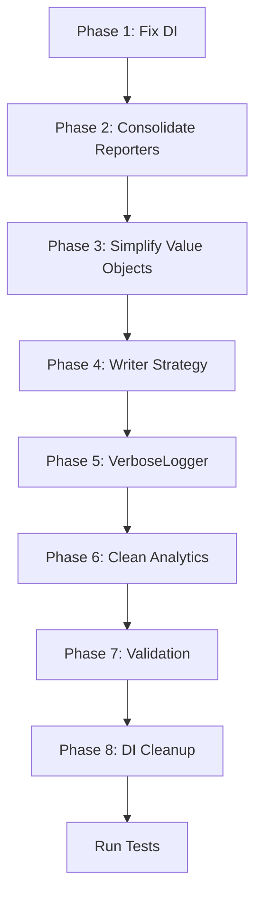
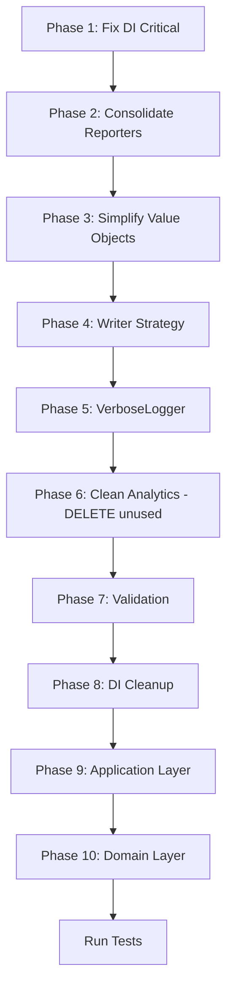

# OmnyReporter Refactoring Plan - Final Version

> **Версия 2** - Обновлено с детальным рефакторингом Application и Domain слоёв

## Принятые решения

| Вопрос                    | Решение                                              |
| ------------------------- | ---------------------------------------------------- |
| Reporter pattern          | **Объединить** Adapter + Reporter → единый Reporter  |
| Vitest                    | **Placeholder** - оставить как заглушку              |
| ConfigValidator           | **Расширить** - zod-валидация для любых данных       |
| DiagnosticSeverity/Source | **Сократить и внедрить** - упростить value objects   |
| Writers                   | **Стратегия** - внедрить через паттерн Strategy      |
| VerboseLogger             | **Внедрить** - для verbose режима по бизнес-правилам |

## Архитектурные принципы

```
┌─────────────────────────────────────────────────────────────────┐
│ Все слои ниже Application зависят ТОЛЬКО от абстракций (Core)  │
├─────────────────────────────────────────────────────────────────┤
│ Domain: минимальные реализации абстракций                      │
│ Reporters: конкретные интеграции, расширяют Domain             │
│ Infrastructure: техническая реализация контрактов              │
└─────────────────────────────────────────────────────────────────┘
```

---

## Phase 1: Fix DI Registrations (Critical)

### Task 1.1: Create `registerApplication.ts`

```typescript
// src/di/registerApplication.ts
export function registerApplication(container: Container): void {
	// Bind GenerateReportUseCase with factory
	container
		.bind(TOKENS.GENERATE_REPORT_USE_CASE)
		.toDynamicValue((ctx) => {
			const sources: IDiagnosticSource[] = [
				ctx.container.get(TOKENS.ESLINT_REPORTER),
				ctx.container.get(TOKENS.TYPESCRIPT_REPORTER),
			];
			return new GenerateReportUseCase(
				sources,
				ctx.container.get(TOKENS.DIAGNOSTIC_AGGREGATOR),
				ctx.container.get(TOKENS.DIAGNOSTIC_ANALYTICS)
			);
		})
		.inTransientScope();

	// Bind DiagnosticApplicationService
	container.bind(TOKENS.DIAGNOSTIC_APPLICATION_SERVICE).to(DiagnosticApplicationService).inSingletonScope();
}
```

### Task 1.2: Update `container.ts`

Add `registerApplication(container)` call.

---

## Phase 2: Consolidate Reporters

### Task 2.1: Merge Adapter into Reporter

**Files affected:**

- `src/reporters/eslint/EslintAdapter.ts` → merge into EslintReporter.ts
- `src/reporters/eslint/EslintReporter.ts` → becomes the single class
- `src/reporters/typescript/TypeScriptAdapter.ts` → merge into TypeScriptReporter.ts
- `src/reporters/typescript/TypeScriptReporter.ts` → becomes the single class

**Result per tool:**

```typescript
// src/reporters/eslint/EslintReporter.ts
export class EslintReporter extends BaseDiagnosticSource {
	public constructor(
		private readonly logger: ILogger,
		private readonly verbose: boolean = false
	) {
		super('eslint');
	}

	protected async doDiagnosticCollection(config: CollectionConfig): Promise<readonly Diagnostic[]> {
		// ESLint integration code directly here
		// (moved from EslintAdapter)
	}
}
```

### Task 2.2: Update DI tokens

```typescript
// Remove ESLINT_ADAPTER, TYPESCRIPT_ADAPTER
// Keep ESLINT_REPORTER, TYPESCRIPT_REPORTER (rename if needed)
```

---

## Phase 3: Simplify Value Objects

### Task 3.1: DiagnosticSeverity

**Delete** `DiagnosticSeverity.ts` class (129 lines).
**Keep** string literal type in `diagnostic.ts`:

```typescript
export type DiagnosticSeverity = 'error' | 'warning' | 'info' | 'note';

// Add simple validation/utility functions if needed:
export const DiagnosticSeverityUtils = {
	isValid: (value: unknown): value is DiagnosticSeverity =>
		typeof value === 'string' && ['error', 'warning', 'info', 'note'].includes(value),

	compare: (a: DiagnosticSeverity, b: DiagnosticSeverity): number => {
		const order = { error: 3, warning: 2, info: 1, note: 0 };
		return order[a] - order[b];
	},
};
```

### Task 3.2: DiagnosticSource

**Delete** `DiagnosticSource.ts` class (102 lines).  
**Keep** string literal type:

```typescript
export type DiagnosticSource = 'eslint' | 'typescript' | 'vitest';

export const DiagnosticSourceUtils = {
	isValid: (value: unknown): value is DiagnosticSource =>
		typeof value === 'string' && ['eslint', 'typescript', 'vitest'].includes(value),

	all: (): readonly DiagnosticSource[] => ['eslint', 'typescript', 'vitest'],
};
```

---

## Phase 4: Implement Writer Strategy

### Task 4.1: Create Writer Strategy Interface

```typescript
// src/core/contracts/IWriterStrategy.ts
export interface IWriterStrategy {
	readonly format: 'json' | 'stream' | 'file';
	write(data: unknown, options: WriteOptions): Promise<Result<WriteStats, Error>>;
}
```

### Task 4.2: Implement Strategies

Writers become strategies:

- `JsonWriterStrategy` (from JsonWriter)
- `FileWriterStrategy` (from FileWriter)
- `StreamWriterStrategy` (from StreamWriter)

### Task 4.3: WriterFactory or Context

```typescript
// src/infrastructure/filesystem/WriterContext.ts
@injectable()
export class WriterContext {
	public constructor(
		@inject(TOKENS.JSON_WRITER_STRATEGY) private jsonStrategy: IWriterStrategy,
		@inject(TOKENS.FILE_WRITER_STRATEGY) private fileStrategy: IWriterStrategy
	) {}

	public getStrategy(format: 'json' | 'file'): IWriterStrategy {
		switch (format) {
			case 'json':
				return this.jsonStrategy;
			case 'file':
				return this.fileStrategy;
		}
	}
}
```

### Task 4.4: Integrate into Application Layer

`DiagnosticApplicationService` should use `WriterContext` to select strategy based on config/format.

---

## Phase 5: Implement VerboseLogger

### Task 5.1: Verbose Logging Strategy

Per business rules:

- `--verbose` flag enables detailed logging
- Logs should show tool execution details

```typescript
// Update DI to support logger selection
export function registerLogging(container: Container): void {
	container
		.bind<ILogger>(TOKENS.LOGGER)
		.toDynamicValue(() => new PinoLogger())
		.inSingletonScope();

	container
		.bind<ILogger>(TOKENS.VERBOSE_LOGGER)
		.toDynamicValue(() => new VerboseLogger())
		.inSingletonScope();
}
```

### Task 5.2: Usage in Reporters

Reporters receive verbose flag and use appropriate logger:

```typescript
export class EslintReporter extends BaseDiagnosticSource {
	public constructor(
		private readonly logger: ILogger,
		private readonly verbose: boolean = false
	) {
		super('eslint');
	}

	protected async doDiagnosticCollection(config: CollectionConfig): Promise<readonly Diagnostic[]> {
		if (this.verbose || config.verboseLogging) {
			this.logger.debug('Starting ESLint analysis', { patterns: config.patterns });
		}
		// ...
	}
}
```

---

## Phase 6: Clean Up Domain Analytics

### Task 6.1: Consolidate Analytics

**Keep:**

- `DiagnosticAnalytics` - generic for all diagnostics

**Remove:**

- `LintAnalytics` - redundant (use DiagnosticAnalytics)
- `TypeScriptAnalytics` - redundant (use DiagnosticAnalytics)

**Keep for tests:**

- `TestAnalytics` - specific for test results (different data structure)

### Task 6.2: Delete Files

```
src/domain/analytics/lint/LintAnalytics.ts ❌
src/domain/analytics/lint/LintStatisticsCalculator.ts ❌
src/domain/analytics/lint/types.ts ❌
src/domain/analytics/typescript/TypeScriptAnalytics.ts ❌
src/domain/analytics/typescript/TypeScriptStatisticsCalculator.ts ❌
src/domain/analytics/typescript/types.ts ❌
```

---

## Phase 7: Update Validation Layer

### Task 7.1: Generic Validation

```typescript
// src/domain/validation/Validator.ts
@injectable()
export class Validator {
	/**
	 * Validate any data against a zod schema
	 */
	public validate<T>(data: unknown, schema: z.ZodType<T>): Result<T, ValidationError> {
		const result = schema.safeParse(data);
		if (result.success) {
			return ok(result.data);
		}
		return err(
			new ValidationError('Validation failed', {
				issues: result.error.issues,
			})
		);
	}
}
```

### Task 7.2: Keep Specific Schemas

- `CollectionConfigSchema`
- `ReportingConfigSchema`
- Add new schemas as needed

---

## Phase 8: Update DI Tokens

### Tokens to Add

```typescript
const APPLICATION = {
	GENERATE_REPORT_USE_CASE: Symbol.for('GenerateReportUseCase'),
	DIAGNOSTIC_APPLICATION_SERVICE: Symbol.for('DiagnosticApplicationService'),
};

const WRITERS = {
	JSON_WRITER_STRATEGY: Symbol.for('JsonWriterStrategy'),
	FILE_WRITER_STRATEGY: Symbol.for('FileWriterStrategy'),
	WRITER_CONTEXT: Symbol.for('WriterContext'),
};
```

### Tokens to Remove

```typescript
// Remove these:
ESLINT_ADAPTER;
TYPESCRIPT_ADAPTER;
CONSOLE_LOGGER; // if not used
```

---

## File Changes Summary

### Files to DELETE

| Path                                            | Reason              |
| ----------------------------------------------- | ------------------- |
| `src/core/types/DiagnosticSeverity.ts`          | Replace with utils  |
| `src/core/types/DiagnosticSource.ts`            | Replace with utils  |
| `src/reporters/eslint/EslintAdapter.ts`         | Merge into Reporter |
| `src/reporters/typescript/TypeScriptAdapter.ts` | Merge into Reporter |
| `src/domain/analytics/lint/*.ts`                | Unused              |
| `src/domain/analytics/typescript/*.ts`          | Unused              |

### Files to MODIFY

| Path                                             | Changes                       |
| ------------------------------------------------ | ----------------------------- |
| `src/reporters/eslint/EslintReporter.ts`         | Include Adapter logic         |
| `src/reporters/typescript/TypeScriptReporter.ts` | Include Adapter logic         |
| `src/core/types/diagnostic.ts`                   | Add utils for Severity/Source |
| `src/di/container.ts`                            | Add registerApplication       |
| `src/di/tokens.ts`                               | Update token list             |
| `src/di/registerReporters.ts`                    | Update bindings               |
| `src/infrastructure/filesystem/*.ts`             | Implement strategies          |

### Files to CREATE

| Path                                             | Purpose                  |
| ------------------------------------------------ | ------------------------ |
| `src/di/registerApplication.ts`                  | Application layer DI     |
| `src/core/contracts/IWriterStrategy.ts`          | Writer strategy contract |
| `src/infrastructure/filesystem/WriterContext.ts` | Strategy selector        |

---

## Execution Order



---

## Test Strategy

1. **After each phase**: Run `npm test`
2. **Integration tests**: Verify CLI still works
3. **Unit tests**: Update mocks as needed

---

## Estimated Impact

| Metric                 | Before | After |
| ---------------------- | ------ | ----- |
| Total files in src/    | ~80    | ~70   |
| Dead code lines        | ~700   | 0     |
| DI registration errors | 2      | 0     |
| Redundant patterns     | 3      | 0     |

---

## Phase 9: Application Layer Refactoring

### Task 9.1: Анализ текущего состояния

**Структура `src/application/`:**

```
src/application/
├── index.ts
├── README.md
├── services/
│   ├── DiagnosticApplicationService.ts
│   └── index.ts
└── usecases/
    ├── GenerateReport.ts
    └── index.ts
```

### Task 9.2: Проблемы Application Layer

1. **README.md ссылается на несуществующий класс:**
    - `CollectDiagnosticsUseCase` - упоминается но НЕ существует
2. **DiagnosticApplicationService проблемы:**
    - Зависит от КОНКРЕТНЫХ классов (`EslintAdapter`, `TypeScriptAdapter`) вместо абстракций
    - Методы `runEslint()` и `runTypeScript()` - дублируют функционал
    - Не зарегистрирован в DI контейнере

3. **GenerateReportUseCase проблемы:**
    - Принимает `sources: readonly IDiagnosticSource[]` но нет DI для инжекции
    - Использует `DiagnosticAnalytics` напрямую вместо интерфейса

### Task 9.3: Рефакторинг DiagnosticApplicationService

**До:**

```typescript
export class DiagnosticApplicationService {
  constructor(
    @inject(TOKENS.LOGGER) private readonly logger: ILogger,
    @inject(TOKENS.ESLINT_ADAPTER) private readonly eslintAdapter: EslintAdapter,
    @inject(TOKENS.TYPESCRIPT_ADAPTER) private readonly typescriptAdapter: TypeScriptAdapter,
    ...
  ) {}
}
```

**После:**

```typescript
export class DiagnosticApplicationService {
  constructor(
    @inject(TOKENS.LOGGER) private readonly logger: ILogger,
    @inject(TOKENS.GENERATE_REPORT_USE_CASE) private readonly generateReport: GenerateReportUseCase,
    @inject(TOKENS.STRUCTURED_REPORT_WRITER) private readonly writer: IWriter<...>,
    @inject(TOKENS.DIRECTORY_SERVICE) private readonly directoryService: IDirectoryService
  ) {}

  // Удалить runEslint(), runTypeScript() - это задача UseCase
  // Оставить только высокоуровневую оркестрацию
}
```

### Task 9.4: Рефакторинг GenerateReportUseCase

**До:**

```typescript
export class GenerateReportUseCase {
	constructor(
		private readonly sources: readonly IDiagnosticSource[],
		private readonly aggregator: DiagnosticAggregator,
		private readonly analytics: DiagnosticAnalytics
	) {}
}
```

**После:**

```typescript
export class GenerateReportUseCase {
	constructor(
		@inject(TOKENS.DIAGNOSTIC_SOURCES) private readonly sources: readonly IDiagnosticSource[],
		@inject(TOKENS.DIAGNOSTIC_AGGREGATOR) private readonly aggregator: IDiagnosticAggregator,
		@inject(TOKENS.DIAGNOSTIC_ANALYTICS)
		private readonly analytics: IAnalyticsCollector<Diagnostic, DiagnosticStatistics>
	) {}
}
```

### Task 9.5: Обновить README

Удалить ссылки на несуществующий `CollectDiagnosticsUseCase` или создать его.

---

## Phase 10: Domain Layer Refactoring

### Task 10.1: Анализ текущего состояния

**Структура `src/domain/`:**

```
src/domain/
├── index.ts
├── README.md
├── aggregation/
│   ├── DiagnosticAggregator.ts
│   └── index.ts
├── analytics/
│   ├── index.ts
│   ├── diagnostics/
│   │   ├── DiagnosticAnalytics.ts
│   │   └── index.ts
│   ├── lint/           ❌ НЕ ИСПОЛЬЗУЕТСЯ
│   ├── tests/          ✓ Используется VitestAdapter
│   └── typescript/     ❌ Зарегистрирован, не используется
├── mappers/
│   ├── DiagnosticMapper.ts
│   └── index.ts
└── validation/
    ├── ConfigValidator.ts
    ├── index.ts
    └── schemas/
```

### Task 10.2: Проблемы Domain Layer

1. **Несуществующие типы в экспортах:**
    - `SeverityCount` - экспортируется но НЕ существует
    - `GroupedBySources` - экспортируется но НЕ существует

2. **Неиспользуемые модули:**
    - `analytics/lint/` - целая папка мёртвого кода
    - `analytics/typescript/` - зарегистрирован но не используется

3. **DiagnosticAggregator:**
    - Не реализует интерфейс (нет `IDiagnosticAggregator`)
    - Зависит от `@core` напрямую - ОК

4. **DiagnosticMapper:**
    - Имеет статические методы И instance метод `map()` - избыточность
    - `toDomain()` возвращает input без изменений - бесполезный метод

5. **ConfigValidator:**
    - Deprecated методы в коде
    - Дублирование статических и instance методов

### Task 10.3: Создать интерфейсы Domain

```typescript
// src/core/contracts/IDiagnosticAggregator.ts
export interface IDiagnosticAggregator {
	aggregate(sources: readonly (readonly Diagnostic[])[]): readonly Diagnostic[];
	aggregateResults(results: readonly PromiseSettledResult<Result<readonly Diagnostic[], Error>>[]): {
		diagnostics: readonly Diagnostic[];
		successCount: number;
	};
}

// src/core/contracts/IDiagnosticMapper.ts
export interface IDiagnosticMapper<TRaw, TPersist> {
	map(raw: TRaw): Diagnostic;
	mapArray(raw: readonly TRaw[]): readonly Diagnostic[];
	toPersistence(diagnostic: Diagnostic): TPersist;
	fromPersistence(data: TPersist): Diagnostic;
}
```

### Task 10.4: Очистить DiagnosticAggregator

```typescript
// Удалить из экспортов:
// export { type SeverityCount, type GroupedBySources }

// Реализовать интерфейс:
@injectable()
export class DiagnosticAggregator implements IDiagnosticAggregator {
	// ...
}
```

### Task 10.5: Упростить DiagnosticMapper

```typescript
// Удалить: toDomain() - бесполезен
// Оставить:
export class DiagnosticMapper extends BaseMapper<RawDiagnosticData, Diagnostic>
  implements IDiagnosticMapper<RawDiagnosticData, PersistentDiagnosticData> {

  public map(input: RawDiagnosticData): Diagnostic { ... }
  public toPersistence(diagnostic: Diagnostic): PersistentDiagnosticData { ... }
  public fromPersistence(data: PersistentDiagnosticData): Diagnostic { ... }
}
```

### Task 10.6: Очистить ConfigValidator

```typescript
// Удалить deprecated методы
// Оставить:
@injectable()
export class ConfigValidator implements IValidator {
  public validate<T>(data: unknown, schema: z.ZodType<T>): Result<T, ValidationError> { ... }
  public validateOrThrow<T>(data: unknown, schema: z.ZodType<T>): T { ... }
}
```

### Task 10.7: Удалить неиспользуемые analytics

**Удалить полностью:**

```
src/domain/analytics/lint/
├── LintAnalytics.ts
├── LintStatisticsCalculator.ts
├── types.ts
└── index.ts

src/domain/analytics/typescript/
├── TypeScriptAnalytics.ts
├── TypeScriptStatisticsCalculator.ts
├── types.ts
└── index.ts
```

**Оставить:**

```
src/domain/analytics/diagnostics/     ✓ Используется
src/domain/analytics/tests/           ✓ Используется VitestAdapter
```

---

## Обновлённые фазы выполнения



---

## Полный список файлов для удаления

| Path                                                                | Reason              |
| ------------------------------------------------------------------- | ------------------- |
| `src/core/types/DiagnosticSeverity.ts`                              | Replace with utils  |
| `src/core/types/DiagnosticSource.ts`                                | Replace with utils  |
| `src/reporters/eslint/EslintAdapter.ts`                             | Merge into Reporter |
| `src/reporters/typescript/TypeScriptAdapter.ts`                     | Merge into Reporter |
| `src/domain/analytics/lint/LintAnalytics.ts`                        | Unused              |
| `src/domain/analytics/lint/LintStatisticsCalculator.ts`             | Unused              |
| `src/domain/analytics/lint/types.ts`                                | Unused              |
| `src/domain/analytics/lint/index.ts`                                | Unused              |
| `src/domain/analytics/typescript/TypeScriptAnalytics.ts`            | Unused              |
| `src/domain/analytics/typescript/TypeScriptStatisticsCalculator.ts` | Unused              |
| `src/domain/analytics/typescript/types.ts`                          | Unused              |
| `src/domain/analytics/typescript/index.ts`                          | Unused              |

---

## Новые интерфейсы для создания

| Interface               | Location              | Purpose             |
| ----------------------- | --------------------- | ------------------- |
| `IDiagnosticAggregator` | `src/core/contracts/` | Aggregator contract |
| `IDiagnosticMapper`     | `src/core/contracts/` | Mapper contract     |
| `IValidator`            | `src/core/contracts/` | Validation contract |
| `IWriterStrategy`       | `src/core/contracts/` | Writer strategy     |
| `IDirectoryService`     | `src/core/contracts/` | Directory service   |

---

## Обновлённые метрики

| Metric                   | Before  | After Est. |
| ------------------------ | ------- | ---------- |
| Total files in src/      | ~80     | ~65        |
| Dead code lines          | ~800+   | 0          |
| Missing DI registrations | 2       | 0          |
| Deprecated methods       | 2       | 0          |
| Unused exports           | 2 types | 0          |
| Concrete dependencies    | 5+      | 0          |
