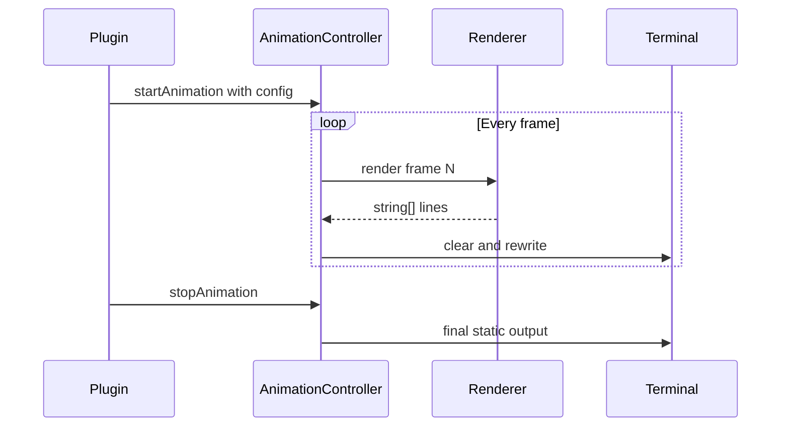
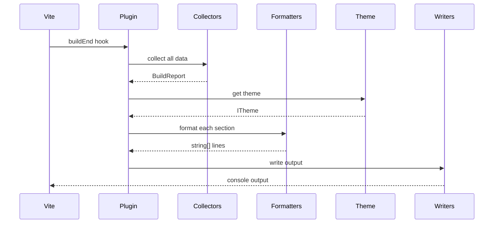
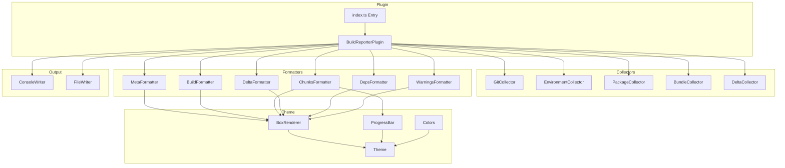

# Vite Build Reporter Plugin - Architecture Plan

## Overview

A Vite plugin that displays **demoscene-inspired, ACiD-style** build reports in the terminal with brutal ASCII aesthetics, animations, and modern minimalist information display.

**Inspiration:** ACiD Productions NFO files, 90s BBS art, tmux panels, modern CLI tools

## Desired Output - ACiD Style

```

        ██████╗ ██╗   ██╗██╗██╗     ██████╗
        ██╔══██╗██║   ██║██║██║     ██╔══██╗
        ██████╔╝██║   ██║██║██║     ██║  ██║
        ██╔══██╗██║   ██║██║██║     ██║  ██║
        ██████╔╝╚██████╔╝██║███████╗██████╔╝
        ╚═════╝  ╚═════╝ ╚═╝╚══════╝╚═════╝

    ═══════════════════════════════════════════════════════════════════════
     R  E  P  O  R  T  E  R     ·     o m n y g r o u p     ·     2 0 2 6
    ═══════════════════════════════════════════════════════════════════════

    ┌─────────────────────────────────────────────────────────────────────┐
    │                      ── RELEASE INFORMATION ──                      │
    ├─────────────────────────────────────────────────────────────────────┤
    │                                                                     │
    │  Project    [ @omnygroup/omnyreporter v0.1.0                    ]   │
    │  Author     [ Ulan Mudrakov <ulan@omny.group>                   ]   │
    │  Branch     [ feat/build-reporter                               ]   │
    │  Commit     [ a1b2c3d                                           ]   │
    │  Released   [ 2026-01-16 23:05:03 MSK                           ]   │
    │                                                                     │
    ├─────────────────────────────────────────────────────────────────────┤
    │                                                                     │
    │  Duration   [ 2.34s           ]   Mode       [ production      ]   │
    │  Target     [ node16          ]   Format     [ esm             ]   │
    │  Runtime    [ Node 22.12.0    ]   Platform   [ macOS Sequoia   ]   │
    │                                                                     │
    └─────────────────────────────────────────────────────────────────────┘

    ┌─────────────────────────────────────────────────────────────────────┐
    │                        ── BUNDLE ANALYSIS ──                        │
    ├─────────────────────────────────────────────────────────────────────┤
    │                                                                     │
    │  Total Size   [ 234.5 KB ]   ████████████████████████░░░░░░  78%   │
    │  Gzip Size    [  78.2 KB ]   ████████░░░░░░░░░░░░░░░░░░░░░░  26%   │
    │  Chunks       [ 47 files ]   Entries   [ 1 ]   Assets [ 12 ]       │
    │                                                                     │
    │  ┌── dist/                                          234.5 KB ──┐   │
    │  │   ├── core/                                       45.2 KB   │   │
    │  │   │   └── contracts/index.js ·················     3.1 KB   │   │
    │  │   │   └── ... 8 more files                        42.1 KB   │   │
    │  │   ├── infrastructure/                             89.3 KB   │   │
    │  │   │   └── logging/PinoLogger.js ··············    12.4 KB   │   │
    │  │   │   └── ... 12 more files                       76.9 KB   │   │
    │  │   ├── domain/ ································    52.1 KB   │   │
    │  │   └── reporters/ ·····························    47.9 KB   │   │
    │  └──────────────────────────────────────────────────────────────┘   │
    │                                                                     │
    └─────────────────────────────────────────────────────────────────────┘

    ┌─────────────────────────────────────────────────────────────────────┐
    │                        ── SIZE COMPARISON ──                        │
    ├─────────────────────────────────────────────────────────────────────┤
    │                                                                     │
    │  Total   234.5 KB ──→ 246.8 KB    ▲ +12.3 KB   (+5.5%)             │
    │  Gzip     78.2 KB ──→  76.1 KB    ▼  -2.1 KB   (-2.6%)      ✓     │
    │                                                                     │
    └─────────────────────────────────────────────────────────────────────┘

    ┌─────────────────────────────────────────────────────────────────────┐
    │                        ── DEPENDENCIES ──                           │
    ├─────────────────────────────────────────────────────────────────────┤
    │  17 packages · chalk inversify neverthrow pino zod yargs ...       │
    └─────────────────────────────────────────────────────────────────────┘

    ┌─────────────────────────────────────────────────────────────────────┐
    │  ⚠  3 warnings · see .build-report/warnings.log for details        │
    └─────────────────────────────────────────────────────────────────────┘

    ═══════════════════════════════════════════════════════════════════════
      ▓▓▓  BUILD COMPLETED SUCCESSFULLY  ▓▓▓
    ═══════════════════════════════════════════════════════════════════════

    ··─────────── Copyright OmnyGroup 2026 · omnyreporter v0.1 ───────────··
```

## Animation System

### Types of Animations

| Animation   | Description                         | Use Case                     |
| ----------- | ----------------------------------- | ---------------------------- |
| **Shimmer** | Rainbow/gradient cycling on borders | Header box, success message  |
| **Typing**  | Typewriter effect for text          | Logo reveal, status messages |
| **Pulse**   | Brightness pulsing                  | Progress indicators          |
| **Slide**   | Text sliding left/right             | Subtitle bar                 |
| **Spinner** | Rotating character                  | Loading states               |
| **Wipe**    | Line-by-line reveal                 | Full report reveal           |
| **Glitch**  | Random character replacement        | Error states                 |

### Animation Architecture

```typescript
// animations/types.ts

export interface IAnimator {
	start(): void;
	stop(): void;
	render(frame: number): string[];
}

export interface AnimationConfig {
	fps: number; // Frames per second (default: 30)
	duration: number; // Duration in ms (0 = infinite)
	easing: EasingFunction; // Easing function
}

export type EasingFunction = 'linear' | 'easeIn' | 'easeOut' | 'easeInOut';

// Rainbow shimmer for borders
export interface ShimmerConfig extends AnimationConfig {
	colors: string[]; // Hex colors to cycle through
	width: number; // Characters to shimmer
	speed: number; // Cycle speed
}

// Typewriter effect
export interface TypewriterConfig extends AnimationConfig {
	text: string;
	speed: number; // ms per character
	cursor: string; // Cursor character
	cursorBlink: boolean;
}
```

### Animation Flow



## Architecture - SOLID Principles

### Directory Structure

```
vite/
├── plugins/
│   └── build-reporter/
│       ├── index.ts                    # Plugin entry + factory function
│       ├── plugin.ts                   # Main BuildReporterPlugin class
│       │
│       ├── core/                       # Types & Contracts
│       │   ├── types.ts                # All TypeScript interfaces
│       │   ├── contracts.ts            # ICollector, IFormatter, IWriter
│       │   └── index.ts                # Barrel export
│       │
│       ├── collectors/                 # Data Collectors - SRP
│       │   ├── GitCollector.ts         # Git: author, branch, sha, dirty
│       │   ├── EnvironmentCollector.ts # Node version, OS, arch
│       │   ├── PackageCollector.ts     # package.json name, version, deps
│       │   ├── BundleCollector.ts      # Analyze Rollup output chunks
│       │   ├── DeltaCollector.ts       # Compare with previous manifest
│       │   └── index.ts
│       │
│       ├── formatters/                 # Section Formatters - SRP
│       │   ├── HeaderFormatter.ts      # ASCII art logo + subtitle
│       │   ├── ReleaseFormatter.ts     # Release info section
│       │   ├── BuildFormatter.ts       # Build stats section
│       │   ├── BundleFormatter.ts      # Bundle analysis + tree
│       │   ├── DeltaFormatter.ts       # Size comparison arrows
│       │   ├── DepsFormatter.ts        # Dependencies summary
│       │   ├── WarningsFormatter.ts    # Warnings section
│       │   ├── FooterFormatter.ts      # Success + copyright
│       │   └── index.ts
│       │
│       ├── animations/                 # Animation Effects - OCP
│       │   ├── types.ts                # IAnimator, AnimationConfig
│       │   ├── AnimationController.ts  # Frame timing & lifecycle
│       │   ├── ShimmerEffect.ts        # Rainbow gradient on text
│       │   ├── TypewriterEffect.ts     # Character-by-character reveal
│       │   ├── PulseEffect.ts          # Brightness oscillation
│       │   ├── WipeEffect.ts           # Line-by-line reveal
│       │   ├── GlitchEffect.ts         # Random char corruption
│       │   ├── presets.ts              # Pre-configured animations
│       │   └── index.ts
│       │
│       ├── theme/                      # Terminal Styling - OCP
│       │   ├── types.ts                # ITheme, IColorPalette, IBoxChars
│       │   ├── DefaultTheme.ts         # Clean minimal theme
│       │   ├── AcidTheme.ts            # ACiD Productions inspired
│       │   ├── MatrixTheme.ts          # Green-on-black hacker
│       │   ├── CyberpunkTheme.ts       # Neon magenta/cyan
│       │   ├── BoxRenderer.ts          # Draw ASCII boxes
│       │   ├── TreeRenderer.ts         # Directory tree drawing
│       │   ├── ProgressBar.ts          # ████░░░░ bars
│       │   ├── AsciiLogo.ts            # Generate ASCII art text
│       │   └── index.ts
│       │
│       ├── output/                     # Output Writers - DIP
│       │   ├── TerminalWriter.ts       # ANSI-aware console output
│       │   ├── FileWriter.ts           # Static .txt/.md file
│       │   ├── JsonWriter.ts           # machine-readable JSON
│       │   └── index.ts
│       │
│       └── utils/                      # Pure Utilities
│           ├── formatBytes.ts          # 1024 → 1 KB
│           ├── formatDuration.ts       # 2345 → 2.34s
│           ├── truncate.ts             # String ellipsis
│           ├── pad.ts                  # Left/right/center padding
│           ├── stripAnsi.ts            # Remove ANSI codes
│           ├── ansi.ts                 # ANSI escape helpers
│           └── index.ts
```

### SOLID Principle Application

#### S - Single Responsibility Principle

| Module            | Responsibility                |
| ----------------- | ----------------------------- |
| `GitCollector`    | Only collects git information |
| `BundleCollector` | Only analyzes Rollup output   |
| `ChunksFormatter` | Only formats chunks tree      |
| `BoxRenderer`     | Only draws ASCII boxes        |
| `Theme`           | Only defines colors/styles    |

#### O - Open/Closed Principle

- **Formatters** can be extended without modification (add new section formatters)
- **Theme** is extensible - create custom themes by implementing interface
- **Collectors** - add new data sources without changing existing ones

#### L - Liskov Substitution Principle

- All `ICollector<T>` implementations are interchangeable
- All `IFormatter` implementations produce consistent output

#### I - Interface Segregation Principle

```typescript
// Small, focused interfaces
interface ICollector<T> {
	collect(): Promise<T>;
}

interface IFormatter<T> {
	format(data: T): string[];
}

interface IWriter {
	write(lines: string[]): void;
}

interface ITheme {
	colors: ColorPalette;
	box: BoxCharacters;
}
```

#### D - Dependency Inversion Principle

- Plugin depends on abstractions (`ICollector`, `IFormatter`), not implementations
- Collectors don't know about formatters
- Formatters don't know about output destination

## Core Types

```typescript
// core/types.ts

export interface BuildMeta {
	projectName: string;
	projectVersion: string;
	author: GitAuthor;
	git: GitInfo;
	timestamp: Date;
}

export interface GitInfo {
	branch: string;
	sha: string;
	shortSha: string;
	dirty: boolean;
}

export interface GitAuthor {
	name: string;
	email: string;
}

export interface BuildInfo {
	duration: number; // ms
	mode: 'development' | 'production';
	target: string;
	environment: EnvironmentInfo;
}

export interface EnvironmentInfo {
	nodeVersion: string;
	os: string;
	arch: string;
}

export interface ChunkInfo {
	name: string;
	path: string;
	size: number; // bytes
	gzipSize?: number;
	isEntry: boolean;
	modules: string[];
}

export interface ChunkGroup {
	name: string;
	path: string;
	totalSize: number;
	chunks: ChunkInfo[];
	children: ChunkGroup[];
}

export interface BundleInfo {
	totalSize: number;
	gzipSize: number;
	chunkCount: number;
	groups: ChunkGroup[];
	chunks: ChunkInfo[];
}

export interface DeltaInfo {
	previousSize: number;
	currentSize: number;
	absoluteDelta: number;
	percentDelta: number;
	previousGzip: number;
	currentGzip: number;
	gzipDelta: number;
	gzipPercentDelta: number;
}

export interface DependencyInfo {
	count: number;
	top: string[]; // Top 5-7 deps to display
	hasMore: boolean;
}

export interface WarningInfo {
	count: number;
	logFile: string | null;
}

export interface BuildReport {
	meta: BuildMeta;
	build: BuildInfo;
	bundle: BundleInfo;
	delta: DeltaInfo | null;
	deps: DependencyInfo;
	warnings: WarningInfo;
}
```

## Contracts

```typescript
// core/contracts.ts

export interface ICollector<T> {
	collect(): Promise<T>;
}

export interface IFormatter<T> {
	format(data: T, theme: ITheme): string[];
}

export interface IWriter {
	write(lines: string[]): void;
}

export interface ITheme {
	readonly width: number;
	readonly colors: IColorPalette;
	readonly box: IBoxChars;
	readonly icons: IIcons;
}

export interface IColorPalette {
	primary: ChalkFn;
	secondary: ChalkFn;
	accent: ChalkFn;
	success: ChalkFn;
	warning: ChalkFn;
	error: ChalkFn;
	muted: ChalkFn;
	text: ChalkFn;
}

export interface IBoxChars {
	topLeft: string;
	topRight: string;
	bottomLeft: string;
	bottomRight: string;
	horizontal: string;
	vertical: string;
	titleLeft: string;
	titleRight: string;
}

export interface IIcons {
	success: string;
	warning: string;
	error: string;
	folder: string;
	file: string;
	up: string;
	down: string;
}
```

## Theme System

### Theme Examples

```typescript
// theme/DefaultTheme.ts - Clean & Minimal
export const defaultTheme: ITheme = {
	name: 'default',
	width: 76,

	colors: {
		primary: chalk.cyan,
		secondary: chalk.blue,
		accent: chalk.magenta,
		success: chalk.green,
		warning: chalk.yellow,
		error: chalk.red,
		muted: chalk.gray,
		text: chalk.white,
		border: chalk.gray,
	},

	box: {
		topLeft: '┌',
		topRight: '┐',
		bottomLeft: '└',
		bottomRight: '┘',
		horizontal: '─',
		vertical: '│',
		cross: '┼',
		teeLeft: '├',
		teeRight: '┤',
		teeUp: '┴',
		teeDown: '┬',
	},

	tree: {
		branch: '├──',
		lastBranch: '└──',
		vertical: '│  ',
		space: '   ',
		dots: '·',
	},

	progress: {
		filled: '█',
		empty: '░',
		left: '',
		right: '',
	},

	icons: {
		success: '✓',
		warning: '⚠',
		error: '✖',
		folder: '📁',
		file: '📄',
		up: '↑',
		down: '↓',
		arrow: '→',
		bullet: '•',
		check: '✓',
		cross: '✗',
	},

	animations: {
		shimmerColors: ['#888888', '#AAAAAA', '#FFFFFF', '#AAAAAA'],
		glitchChars: '!@#$%^&*<>[]{}',
	},
};

// theme/AcidTheme.ts - ACiD Productions BBS Style
export const acidTheme: ITheme = {
	name: 'acid',
	width: 76,

	colors: {
		primary: chalk.hex('#00BFFF'), // Deep sky blue
		secondary: chalk.hex('#9370DB'), // Medium purple
		accent: chalk.hex('#FF69B4'), // Hot pink
		success: chalk.hex('#00FF7F'), // Spring green
		warning: chalk.hex('#FFD700'), // Gold
		error: chalk.hex('#FF4500'), // Orange red
		muted: chalk.hex('#708090'), // Slate gray
		text: chalk.hex('#F5F5F5'), // White smoke
		border: chalk.hex('#4682B4'), // Steel blue
	},

	box: {
		topLeft: '╔',
		topRight: '╗',
		bottomLeft: '╚',
		bottomRight: '╝',
		horizontal: '═',
		vertical: '║',
		cross: '╬',
		teeLeft: '╠',
		teeRight: '╣',
		teeUp: '╩',
		teeDown: '╦',
	},

	tree: {
		branch: '╠══',
		lastBranch: '╚══',
		vertical: '║  ',
		space: '   ',
		dots: '·',
	},

	progress: {
		filled: '▓',
		empty: '░',
		left: '[',
		right: ']',
	},

	icons: {
		success: '▓▓▓',
		warning: '░░░',
		error: '███',
		folder: '┌─',
		file: '│ ',
		up: '▲',
		down: '▼',
		arrow: '►',
		bullet: '■',
		check: '√',
		cross: 'x',
	},

	animations: {
		shimmerColors: ['#00BFFF', '#9370DB', '#FF69B4', '#00FF7F', '#FFD700'],
		glitchChars: '▓▒░█▄▀■□●○◆◇',
	},
};

// theme/MatrixTheme.ts - Hacker Green Terminal
export const matrixTheme: ITheme = {
	name: 'matrix',
	width: 76,

	colors: {
		primary: chalk.hex('#00FF00'), // Bright green
		secondary: chalk.hex('#00CC00'), // Medium green
		accent: chalk.hex('#00FF66'), // Lime
		success: chalk.hex('#00FF00'),
		warning: chalk.hex('#CCFF00'), // Yellow-green
		error: chalk.hex('#FF3300'),
		muted: chalk.hex('#006600'), // Dark green
		text: chalk.hex('#00FF00'),
		border: chalk.hex('#009900'),
	},

	box: {
		topLeft: '┏',
		topRight: '┓',
		bottomLeft: '┗',
		bottomRight: '┛',
		horizontal: '━',
		vertical: '┃',
		cross: '╋',
		teeLeft: '┣',
		teeRight: '┫',
		teeUp: '┻',
		teeDown: '┳',
	},

	tree: {
		branch: '├─',
		lastBranch: '└─',
		vertical: '│ ',
		space: '  ',
		dots: '.',
	},

	progress: {
		filled: '▰',
		empty: '▱',
		left: '⟨',
		right: '⟩',
	},

	icons: {
		success: '◉',
		warning: '◎',
		error: '◉',
		folder: '▸',
		file: '·',
		up: '△',
		down: '▽',
		arrow: '▸',
		bullet: '▪',
		check: '◉',
		cross: '○',
	},

	animations: {
		shimmerColors: ['#003300', '#006600', '#009900', '#00CC00', '#00FF00'],
		glitchChars: '01アイウエオカキクケコ',
	},
};

// theme/CyberpunkTheme.ts - Neon Synthwave
export const cyberpunkTheme: ITheme = {
	name: 'cyberpunk',
	width: 76,

	colors: {
		primary: chalk.hex('#FF00FF'), // Magenta
		secondary: chalk.hex('#00FFFF'), // Cyan
		accent: chalk.hex('#FF6EC7'), // Hot magenta
		success: chalk.hex('#39FF14'), // Neon green
		warning: chalk.hex('#FFFF00'), // Yellow
		error: chalk.hex('#FF0000'),
		muted: chalk.hex('#666699'),
		text: chalk.hex('#FFFFFF'),
		border: chalk.hex('#9900FF'), // Purple
	},

	box: {
		topLeft: '╭',
		topRight: '╮',
		bottomLeft: '╰',
		bottomRight: '╯',
		horizontal: '─',
		vertical: '│',
		cross: '┼',
		teeLeft: '├',
		teeRight: '┤',
		teeUp: '┴',
		teeDown: '┬',
	},

	tree: {
		branch: '├──',
		lastBranch: '╰──',
		vertical: '│  ',
		space: '   ',
		dots: '·',
	},

	progress: {
		filled: '▓',
		empty: '░',
		left: '«',
		right: '»',
	},

	icons: {
		success: '◆',
		warning: '◇',
		error: '◆',
		folder: '▶',
		file: '▪',
		up: '▴',
		down: '▾',
		arrow: '▸',
		bullet: '◦',
		check: '◆',
		cross: '◇',
	},

	animations: {
		shimmerColors: ['#FF00FF', '#FF00CC', '#CC00FF', '#00FFFF', '#00CCFF'],
		glitchChars: '█▓▒░╳╱╲◢◣◤◥',
	},
};
```

## Plugin Configuration

```typescript
// index.ts

export interface BuildReporterOptions {
	/** Enable/disable the plugin (default: true) */
	enabled?: boolean;

	/** Terminal width (default: 76) */
	width?: number;

	/** Theme to use */
	theme?: 'default' | 'acid' | 'matrix' | 'cyberpunk' | ITheme;

	/** Sections to show */
	sections?: {
		header?: boolean; // ASCII logo
		release?: boolean; // Project/author/git info
		build?: boolean; // Duration/mode/target
		bundle?: boolean; // Chunks tree
		delta?: boolean; // Size comparison
		deps?: boolean; // Dependencies
		warnings?: boolean; // Warnings
		footer?: boolean; // Success message
	};

	/** Chunk grouping depth (1-3, default: 2) */
	chunkDepth?: number;

	/** Show gzip sizes (default: true) */
	gzip?: boolean;

	/** Save report to file */
	outputFile?: string | null;

	/** Previous build manifest for delta comparison */
	compareWith?: string | null;

	/** Animation settings */
	animations?: {
		/** Enable animations (default: true if TTY) */
		enabled?: boolean;

		/** Header logo reveal animation */
		headerReveal?: 'none' | 'typewriter' | 'wipe' | 'glitch';

		/** Border shimmer effect */
		shimmer?: boolean;

		/** Success message effect */
		successEffect?: 'none' | 'pulse' | 'shimmer' | 'glitch';

		/** Animation duration multiplier (0.5 = faster, 2 = slower) */
		speed?: number;

		/** Hold final animation for N ms before static output */
		holdDuration?: number;
	};

	/** Copyright text in footer */
	copyright?: string;

	/** Custom ASCII logo lines (array of strings) */
	logo?: string[];
}

export function buildReporter(options: BuildReporterOptions = {}): Plugin {
	return new BuildReporterPlugin(options).toVitePlugin();
}

// Default options
const defaultOptions: Required<BuildReporterOptions> = {
	enabled: true,
	width: 76,
	theme: 'acid',
	sections: {
		header: true,
		release: true,
		build: true,
		bundle: true,
		delta: true,
		deps: true,
		warnings: true,
		footer: true,
	},
	chunkDepth: 2,
	gzip: true,
	outputFile: null,
	compareWith: '.build-report/manifest.json',
	animations: {
		enabled: process.stdout.isTTY ?? false,
		headerReveal: 'typewriter',
		shimmer: true,
		successEffect: 'pulse',
		speed: 1,
		holdDuration: 1500,
	},
	copyright: 'OmnyGroup',
	logo: [], // Use default BUILD logo
};
```

## Flow Diagram



## Component Diagram



## Implementation Priority

### Phase 1: Core Foundation

- [ ] `core/types.ts` - All TypeScript interfaces
- [ ] `core/contracts.ts` - ICollector, IFormatter, IWriter, ITheme
- [ ] `utils/` - formatBytes, formatDuration, pad, ansi helpers
- [ ] `theme/types.ts` - Theme interface definitions
- [ ] `theme/BoxRenderer.ts` - ASCII box drawing
- [ ] `output/TerminalWriter.ts` - Basic console output

### Phase 2: Data Collection

- [ ] `collectors/GitCollector.ts` - Branch, SHA, author from git
- [ ] `collectors/PackageCollector.ts` - name, version, deps from package.json
- [ ] `collectors/EnvironmentCollector.ts` - Node version, OS, arch
- [ ] `collectors/BundleCollector.ts` - Analyze Rollup output chunks
- [ ] `plugin.ts` - Main plugin class with buildEnd hook

### Phase 3: Formatters & Themes

- [ ] `theme/DefaultTheme.ts` - Clean theme
- [ ] `theme/AcidTheme.ts` - ACiD Productions style
- [ ] `theme/AsciiLogo.ts` - Generate ASCII art
- [ ] `theme/TreeRenderer.ts` - Directory tree
- [ ] `theme/ProgressBar.ts` - ████░░░░ bars
- [ ] `formatters/HeaderFormatter.ts` - Logo + subtitle
- [ ] `formatters/ReleaseFormatter.ts` - Project info box
- [ ] `formatters/BuildFormatter.ts` - Build stats
- [ ] `formatters/BundleFormatter.ts` - Chunks tree
- [ ] `formatters/DepsFormatter.ts` - Dependencies
- [ ] `formatters/WarningsFormatter.ts` - Warnings
- [ ] `formatters/FooterFormatter.ts` - Success + copyright

### Phase 4: Animations

- [ ] `animations/types.ts` - Animation interfaces
- [ ] `animations/AnimationController.ts` - Frame timing
- [ ] `animations/TypewriterEffect.ts` - Text reveal
- [ ] `animations/ShimmerEffect.ts` - Rainbow gradient
- [ ] `animations/PulseEffect.ts` - Brightness cycle
- [ ] `animations/WipeEffect.ts` - Line-by-line
- [ ] `animations/GlitchEffect.ts` - Random corruption
- [ ] `animations/presets.ts` - Pre-configured combos

### Phase 5: Advanced Features

- [ ] `collectors/DeltaCollector.ts` - Size comparison
- [ ] `formatters/DeltaFormatter.ts` - Delta arrows
- [ ] `output/FileWriter.ts` - Persistent reports
- [ ] `output/JsonWriter.ts` - Machine-readable
- [ ] `theme/MatrixTheme.ts` - Hacker green
- [ ] `theme/CyberpunkTheme.ts` - Neon synthwave

### Phase 6: Integration & Polish

- [ ] `index.ts` - Plugin factory function
- [ ] Unit tests for formatters
- [ ] Unit tests for collectors
- [ ] Integration test with real build
- [ ] Update vite.config.ts
- [ ] README documentation

## Key Design Decisions

### 1. Why Not Using Existing Project's DI Container?

The plugin is intentionally standalone and self-contained:

- No inversify dependency - keeps plugin lightweight
- Simple factory pattern for component creation
- Can be extracted to npm package later

### 2. Chunk Grouping Strategy

```typescript
// ChunksFormatter groups by directory structure
dist/
├── core/           (sum of all files in core/)
├── infrastructure/ (sum of all files)
├── domain/         (sum of all files)
└── reporters/      (sum of all files)

// Each group shows:
// - Top 1-2 largest files explicitly
// - "... (N more)" for the rest
```

### 3. Delta Size Persistence

```json
// .build-report/manifest.json
{
  "timestamp": "2026-01-16T20:05:03Z",
  "totalSize": 234567,
  "gzipSize": 78234,
  "chunks": {...}
}
```

### 4. Warning Aggregation

Warnings are collected but not displayed in full - just count and log file path.

## Dependencies

No new dependencies required - reuses existing:

- `chalk` - colors (already in project)
- Node.js built-in: `child_process` for git, `os` for environment

## Usage Example

```typescript
// vite.config.ts
import { buildReporter } from './vite/plugins/build-reporter';

export default defineConfig({
	plugins: [
		buildReporter({
			theme: 'brutal',
			gzip: true,
			sections: {
				meta: true,
				build: true,
				chunks: true,
				delta: true,
				deps: true,
				warnings: true,
			},
		}),
	],
});
```

---

**Status:** Ready for implementation  
**Type:** Vite Plugin  
**Location:** `vite/plugins/build-reporter/`
